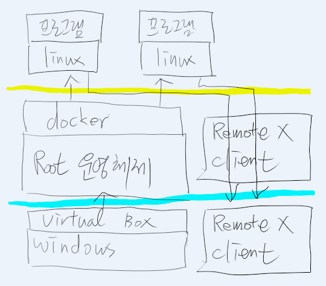

# 컴퓨터 구성

<!--
description = 정리자료
tag = it, pc, docker, virtual box
-->

2017년 1월 기준
1. 집에 컴퓨터를 개발 위주로 사용하고 있고, 공공사이트 이외에 윈도우의 필요성이 줄어들었으며, 모바일을 활용해 윈도우 사용을 대체할 수 있어짐에 따라 다양한 개발환경 구성과 복구가 편리하고 보안성을 가지는 환경을 만들고자 한다.
2. 서버로 사용하고 있는 NAS(Samba), Git서버, Tomcat서버 용도의 기능을 우선 리눅스-docker로 구성한다.
3. Docker를 활용한 가상 컨테이너 구성하여 보안 문제 발생시 모든 시스템을 스크립트를 통한 초기화 복구가 가능하다
4. 서비스별 독립 컨테이너를 사용하고 루트 시스템에 서비스 접속은 사용하지 않는 방법으로 보안 문제를 차단한다.
5. Xwindow 원격접속을 활용한 중앙관리 시스템 구축.
6. 데이터는 루트 시스템에서 컨테이너 공유.
7. 동일한 환경을 다른 컨테이너 시스템으로 옮기기 편리함.
8. 윈도우 시스템을 버릴수는 없는 상태이기에 윈도우 종속 서비스를 위해 루트시스템에 윈도우를 기본으로 virtual box 를 이용해 ubuntu-docker 를 설치.
9. Vagrant 도 고려하였으나 스크립트 작업.

## 방화벽

1. 공유기 방화벽.
2. 루트시스템 방화벽 설정.
    - ssh 포트 변경, 지정 아이피 허용.
    - 서비스 포트 변경, 사용 포트만 허용.

## Virtual box windows 루트시스템

1. vm 생성 xubuntu (16.04_64 기준)
2. Nat ssh 포트포워딩 호스트 20022-> 게스트 22
3. 공유폴더 data->data
    - sudo apt-get install virtualbox-guest-additions-iso
    - sudo mount -o loop /usr/share/virtualbox/VBoxGuestAdditions.iso /mnt
    - sudo sh /mnt/VBoxLinuxAdditions.run
    - sudo mount -t vboxsf /data /data
4. 공유폴더 자동마운트
    - /etc/init.d/rc.local
    - mount -t vboxsf -o uid=1000,gid=1000,dmode=0755,fmode=0755 /data /data
5. VM Background 실행, 종료
    - VboxManage startvm xubuntu16 --type headless
    - VboxManage controlvm xubuntu16 acpipowerbutton

## 루트시스템 ubuntu 서버 64 설치

1. 직접 서비스를 사용하지 않기에 서버버전 설치 고려. 가벼운 boot2docker 고려.
2. docker container 와 설정 확인용, x2go 클라이언트 연결 목적으로 xubuntu 16.04 설치(ubuntu + xfce)
3. 기본기능 $ apt-get install git vim openssh-server
4. 보안설정
    - sudo ufw enable
    - sudo ufw allow 22/tcp
    - sudo ufw allow from 192.168.0.0/24 to any port 22 proto tcp [확인못함]
5. Docker Prerequisites
    - sudo apt-get update
    - sudo apt-get install apt-transport-https ca-certificates
    - sudo apt-key adv \
    --keyserver hkp://ha.pool.sks-keyservers.net:80 \
    --recv-keys 58118E89F3A912897C070ADBF76221572C52609D
    - echo "deb https://apt.dockerproject.org/repo ubuntu-xenial main" | sudo tee /etc/apt/sources.list.d/docker.list
    - sudo apt-get update
    - apt-cache policy docker-engine
6. Docker Install
    - sudo apt-get update
    - sudo apt-get install docker-engine
    - sudo service docker start
    - sudo usermod -aG docker $USER
    - Ufw설정 = /etc/default/ufw DEFAULT_FORWARD_POLICY="ACCEPT" (sudo ufw reload)
    - Start on boot = sudo systemctl enable docker

## 루트시스템 github.com/shimjye/xubuntu-docker

1. Github project 스크립트 이용 virtualbox ubuntu root 운영체제 설정
2. Xubuntu 설치.
3. Vm 설정 nat, cpu, memory, share folder
4. apt-get install vim git openssh-server
5. git clone https://github.com/shimjye/xubuntu-docker
6. run virtualbox script
7. run bootstrap script

## Docker base image

1. https://hub.docker.com/r/shimjye/xubuntu-x2go-kr/
    - docker run -d -p 2222:22 --name x2 -v /data:/data shimjye/xubuntu-x2go-kr
2. Build Dockerfile 방법 = docker build -t [image] .
    - docker run -d -p 2222:22 --name [name] -v /data:/data [image]
    - tail -f /dev/null 데몬이 정지되지 않도록할때. Dockerfile에 cmd 명령으로 입력하지 않음
    - docker exec -it [name] /bin/bash

## Docker hub base image 참고

1. Ubuntu x2go mate 참고
    - https://hub.docker.com/r/leonpegg/ubuntu-x2go-mate/ ubuntu 14.04
    - CID=$(docker run -d -p 2222:22 --name x2mate1 -v /data:/data leonpegg/ubuntu-x2go-mate)
    - docker logs $CID
2. Ubuntu x2go xfce 참고
    - Ubuntu 16.04 LTS 버전에 x2go 를 이용한 원격 시스템. x2go 지원에 문제가 적을것으로 예상되는 xfce 선택. Ubuntu + xface = xubuntu. https://www.xfce.org/
    - https://hub.docker.com/r/paimpozhil/docker-x2go-xubuntu/ 참고 14버전
    - https://hub.docker.com/r/kirkins/xubuntu16-x2go fork 소스 16.04버전
    - CID=$(docker run -d -p 2222:22 --name x2 -v /data:/data kirkins/xubuntu16-x2go)
3. Dbus 미실행 문제
    - run.sh 스크립트 실행으로 처리
4. 설정작업
    - 한글설정 출처: <https://forum.ubuntu-kr.org/viewtopic.php?f=22&t=18025>
    - Profile
        - LANG="ko_KR.utf8"
        - LC_ALL="$LANG"
        - LANGUAGE="ko_KR;ko;en_GB;en"
        - IM=fcitx
        - XIM=$IM
        - GTK_IM_MODULE=$IM
        - QT_IM_MODULE=$IM
        - XMODIFIERS="@im=$IM"
        - export LANG LC_ALL LANGUAGE IM XIM GTK_IM_MODULE QT_IM_MODULE XMODIFIERS
    - environment
        - LANG="ko_KR.utf8"
        - LANGUAGE="ko_KR;ko;en_GB;en"
        - LC_ALL="ko_KR.utf8"
    - 한글입력기
    - http://kwonnam.pe.kr/wiki/linux/inputmethod
    - https://wiki.archlinux.org/index.php/Fcitx
    - sudo apt-get install fcitx fcitx-hangul
    - Ibus firefox 한글변경 문제로 fcitx 사용
    - 전체 한글설정 참고 프로젝트 참고
    - https://github.com/hedone21/ubuntu-korean-settings/blob/master/cobuntu-config

## docker service image 추후 작업

1. 스크립트 정보의 정리.
2. 생성한 이미지를 base로 하는 기능 docker 생성작업.
3. Samba, Tomcat, Git server 서버기능 docker.
4. Java eclipse, Python eclipse... 개발기능 docker.
5. X2go 기능 설정 개선.

## 작업기
- Windows를 사용하지 않는것을 최종목표로 간만에 linux 작업을 많이 수행함.
- Docker를 기반으로 하는 시스템 구성은 Windows를 넘어서는 기능으로 linux 가 엄청나게 발전했을 뿐 아니라 모든 신기술이 linux 를 시작으로 개발이 되고 있다는 생각을 함.
- X2go가 오래된 프로젝트이며 처리 속도의 기술은 아직 windows rdp 를 따라가지 못했고 실사용에 있어 통신의 종료와 기능의 사용의 문제가 있으나 아주 가까운 몇년후에는 이러한 시스템이 미래 컴퓨터일 것이라고 생각함.
- Linux 만 사용했다 하면 삽질의 연속. 한글 삽질의 연속이었으나 전보다는 많은 도움되는 프로젝트들이 있는것 같음.
- 미래에는 스마트 와치에 내장된 컴퓨터에 widi 기술이 접목되어 모니터, 키보드 환경에 원격 연결하여 어디에서나 내 컴퓨터 기능을 수행하며, 스마트 와치에 내장된 전화로 통화를 하며, 이동식 모니터에 연결되어 이동하면서도 인터넷을 사용할 수 있지 않을까. 몇 년 뒤 가까운 미래.
