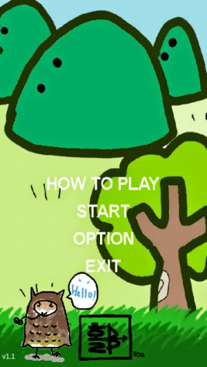
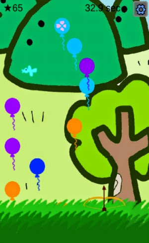
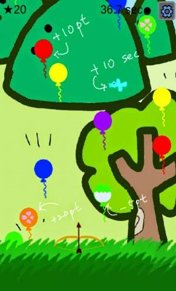

# [Android Game]bow

<!--
description = 정리자료
tag = android, bow, game, project
-->

그동안 만들어진 게임이 재미없다하여 너가 직접 해봐라 해서 간단하게 완성한 게임.
기획은 전혀 안하고 개발만 해줌.
배경그림은 친구에게 얻어서 득.ㅎ

https://play.google.com/store/apps/details?id=com.shimjye.android.bow

- 활슈팅게임.
- 새를맞춰라!!
- 강한중독성게임.
- 특징
- 단순한 원터치 방식의 조작.
- 활을 터치하여풍선터트리기.
- 꽃풍선을터트리면보너스점수.
- 물풍선을터트리면마이너스점수.
- 새를맞추면보너스타임.
- 누가누가잘하나. 랭킹올리기.
- 게임을방해하지않는only 상단바광고 포함.
- 광고,통계랭킹에서인터넷을 사용합니다.

--------
## 사용권한
- INTERNET -AD(Admob), Analytics(Google), ranking
- ACCESS_NETWORK_STATE -AD(admob), Analytics(Google)
- WRITE_EXTERNAL_STORAGE -Game
- VIBRATE -Game
게임, 아케이드, 전체
