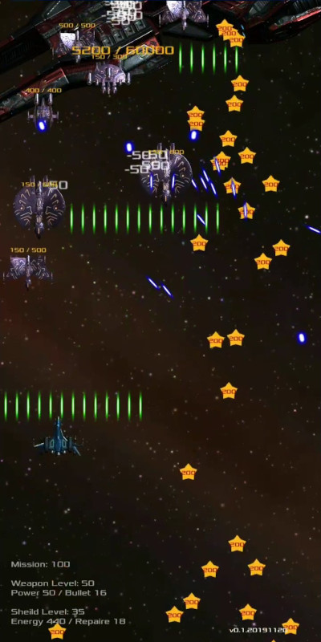

# [Android Game]10Cent Space Shooter

<!--
description = 정리자료
tag = android, game, project, 10-cent, space, shooter
AD(admob)
- 통계를 위해 인터넷을 사용합니다.
- INTERNET - for analytics(google)
- ACCESS_NETWORK_STATE(네트워크) - for analytics(google)
- https://shimjye.github.io/article/it/etc/privacy-simple.html
- https://youtu.be/ICeThhh6Ut4
- img 400*840
-->

https://play.google.com/store/apps/details?id=com.sootnoon.android.cent.shoot

Space 게임을 만드는 도중 공격력 방어력 밸런스를 위한 개발물을 게임화.

- 피할수 없는 수많은 레이저가 계속해서 날아옵니다. 적을 먼저 파괴하고! 방어력를 강화!
- 우주 슈팅 액션 게임.
- 단순한 원터치 방식의 조작.
- 떨어지는 별을 통해 점수 획득.
- 이 게임은 추상화된 공격성을 포함하고 있으며, 나이가 어린 사용자의 경우 부모님의 지도가 필요합니다.
- 모든 게임 정보는 폰에만 저장되며 앱을 삭제시 데이터가 삭제됩니다.

- Inevitable countless lasers. Destroy the enemy first! Strengthen your defenses!
- Space shooting action game.
- Simple one touch operation.
- Get score through falling stars.
- The game includes abstracted aggression, and younger users need parental guidance.
- All game information is stored only in the phone and data is deleted when you delete the app.

## 사용권한 Permission
- VIBRATE - for game
