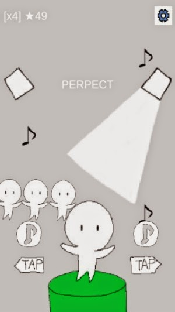
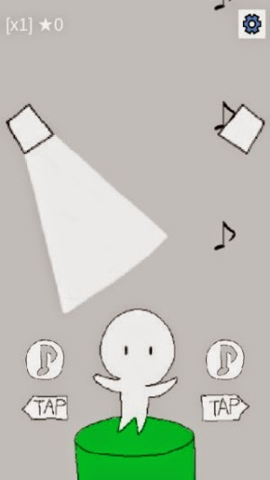
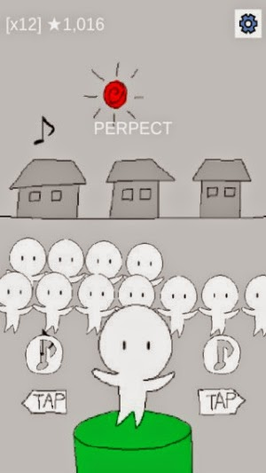

# 미게시[안드로이드게임] dance with

<!--
description = 정리자료
tag = android, dance with, game, project
-->

문득 생각난거 간단하게 만들어보기.
업적기능까지 생각했었는데 간단하게 개발하지 않음.
생각보다는?? 반응이 좋아 추가 개발하게 될지도...

https://play.google.com/store/apps/details?id=com.shimjye.android.dancewith

- 최고로단순한리듬게임.
- 무반주댄스?!?
- 춤추는사람이많을수록점수가증가합니다.
- 랭킹에서인터넷을사용합니다.

## 사용권한
- INTERNET -Ranking
- WRITE_EXTERNAL_STORAGE -Game
- VIBRATE -Game
