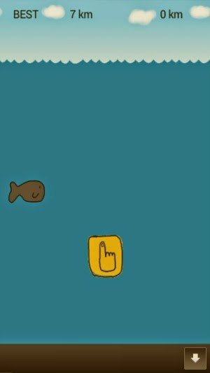

# 미게시[Android Game]Dream of Whale 고래의 꿈

<!--
description = 정리자료
tag = android, dream of whale, game, project, 고래의꿈
-->

https://play.google.com/store/apps/details?id=com.shimjye.android.dreamofwhale

[English]

Dream of Whale
- flappy bird style game
- save the whale!!
- ads includes

Permission desc
- VIBRATE game
- READ_EXTERNAL_STORAGE game
- WRITE_EXTERNAL_STORAGE game
- INTERNET ad module
- ACCESS_NETWORK_STATE ad module

[한글]

고래의 꿈
- 플라피 버드 형식 게임
- 고래를 구하자
- 광고 포함

## 사용권한
- VIBRATE 게임
- READ_EXTERNAL_STORAGE 게임
- WRITE_EXTERNAL_STORAGE 게임
- INTERNET 광고모듈
- ACCESS_NETWORK_STATE 광고모듈

게임, 캐주얼, 전체이용가

처음만들어 보는 습작 게임
바야바앤진 사용 개발
요즘 유행하는 플라피 버드에 탑승하며,
터치시 거꾸로 잠수하는 방식으로 게임진행

지사랑 웹툰 http://www.jisadong.com/
네이버 웹툰 그린스마일 http://comic.naver.com/webtoon/list.nhn?titleId=72938
를 보면서 아이디어를 생각했으며
남극의 눈물의 혹등고래(humpback whale)가 25000km를 수영한다는 점
그리고 일본을 비롯한 몇몇 포경국가의 아이디어를 바탕으로
하고 싶었으나 그냥 플라피버드 형식게임ㅋ

그림은 열심히 발로 그리고 음악은 없고
다음 게임에서는 좀 더 화면을 추가해서 발전시켜야겠다. 하나하나
중간 멈춤도 없고 로고도 없고, 중간에 전화오면 게임 끝
결과에 비해 시간도 오래 걸리고 익숙치 않아 소스도 엉망인 그냥 안드로이드 장난감용 습작
