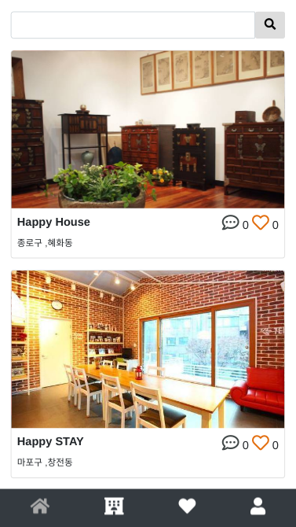
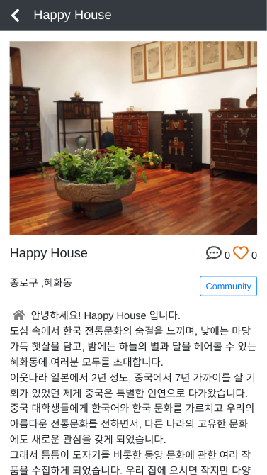

# [Android App]Moon of (공유숙박)

<!--
description = 정리자료
tag = android, app, project, moonof, 공유숙박
-->

https://play.google.com/store/apps/details?id=com.sootnoon.android.goose

아이디어를 생각해 주변기능은 모두 제거하고 빠르게 만든앱.
앱과 서버와 관리자 처리의 기본적인 기능을 모두 포함하는 프로젝트.

Moon of (공유숙박)는 서울의 공유숙박 업소 정보를 보여주는 서비스 입니다.
- 현재 서울의 업체 정보가 인터넷 정보를 통해 작성되어 있습니다.
- 정보 등록 수정이 필요할시에는 앱의 feedback 기능을 통해 연락할 수 있습니다.
- 커뮤니티 서비스를 이용하기 위해서는 회원가입과 로그인이 필요합니다.
- 정책상 회원가입은 만 14세 이상 가능합니다.

## 사용권한
- INTERNET: 인터넷을 통한 정보통신
- ACCESS_NETWORK_STATE: 인터넷 정보확인
