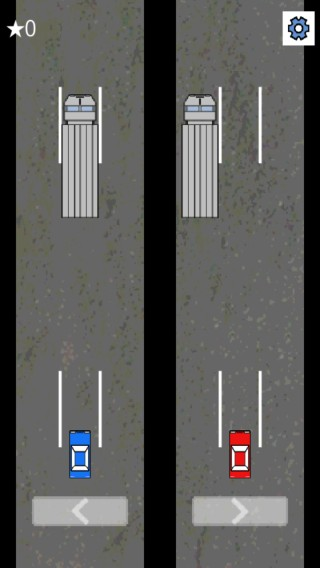

# 미게시[Android Game]3Lanes X2 3차선 X2

<!--
description = 정리자료
tag = 3lanes, android, game, project
-->

https://play.google.com/store/apps/details?id=com.shimjye.android.lanes

처음에는 이것보다 조금 더 복잡한 게임으로 구상을 했었는데 만들다가 단순하게 생각난 게임
간단하고 간단하고 간단하면서 나름 괜찮은 아이디어인 것 같다.
너무 단순하게 만드는 것 같아 한참을 고민했는데 확실히 간단한 아이디어가 좋다.
처음생각도 한 개의 핸들로 두 대의 차를 움직이는 것이긴 했는데 2대의 차가 서로 다른 차선을 이용할 수 있도록 하려고 생각하다가 설명하기도 어렵고 만들기도 어렵고.

- 단순하면서 강한 중독성의 게임.
- 하나의 운전대와 2대의 자동차.
- 점점 빠른 속도에 도전.
- 특징
    - 좌, 우 버튼으로 2대의 차가 같이 움직입니다. 트럭을 피해 더 오래 달리세요.
    - 단순한 원터치 방식의 조작.

## 사용권한
- INTERNET - Ranking
- WRITE_EXTERNAL_STORAGE - Game
- VIBRATE - Game
