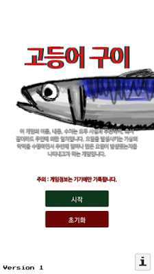
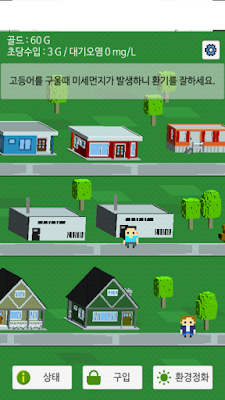

# [Android Game]고등어 구이-미세먼지

<!--
description = 정리자료
tag = android, game, project, 고등어구이, 미세먼지
-->

https://play.google.com/store/apps/details?id=com.sootnoon.android.sulfur

별거 없지만 정말 오래동안 한줄씩 만든 게임. 그래도 어느정도 완성을 해서 마무리..
민감한 내용에 대해서는 비판의 목적은 있지만 정치적 비난 목적은 없습니다. 나를 포함하는 모든사람을 비판하고 싶은 마음으로 만들어졌음을 밝히며, 확대 해석은 거절하겠습니다.
환경이 좋아졌으면 하는 바람입니다.

매일매일 심해지는 미세먼지. 왜 이렇게 먼지가 심해질까요?
누군가는 이렇게 돈을 벌고 있지 않을까? 이제 당신도 한 번 돈을 벌어보세요.
단순한 클릭커 스타일에 구입과 환경정화의 균형을 조절하며 수입을 올리세요.
당신의 선택에 따라 환경정화를 하지않고 수입을 올리는데만 집중할 수 있습니다. 하지만 사망자가 많이 발생하고 고등어를 사먹을 사람이 줄어들면 그만큼의 수입은 감소하겠지요.
게임은 단순하지만 최종단계까지 도달하기 불가능한 고난이도로 개발되었습니다.
주어진 시간 한 시간 동안 수입을 올리고 고득점을 올리세요.
고등어를 구울때 키친타월을 덮어서 구워주면 기름도 튀지 않고 미세먼지도 잡아 줍니다. 환기도 필수적으로 잘 시켜주세요.

- 이 게임은 오염을 발생시키는 가상의 악역을 수행하면서 주변에 얼마나 많은 오염이 발생하고있는지를 나타내고자 하는 의도의 게임입니다. 게임의 이름, 내용, 수치는 모두 사실과 무관하며, 혹시 같더라도 우연에 의한 일치입니다.
- 이 게임은 가상의 악역을 수행하며 숫자로만 표시되는 사망자를 발생시키는 내용이 포함되어 있습니다. 나이가 어린 사용자의 경우 부모님의 지도가 필요합니다.
- 게임을 방해하지 않는 Only 상단 바 광고가 포함되어 있습니다.
- 광고, 통계에서 인터넷을 사용합니다.
- 모든 게임 정보는 폰에만 저장되며 앱을 삭제시 데이터가 삭제됩니다.

------
## 사용권한
- INTERNET(인터넷) - 광고(admob), 통계(google)
- ACCESS_NETWORK_STATE(네트워크) - 광고(admob), 통계(google)
- VIBRATE(진동) - 게임
