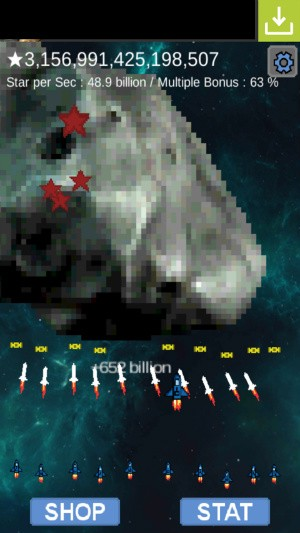

# [안드로이드 게임]Space War-Clicker

<!--
description = 정리자료
tag = android, clicker, cookie clicker, game, project, space war
-->

[링크] https://play.google.com/store/apps/details?id=com.shimjye.android.spacewarclicker

- 우주 슈팅 clicker 게임.
- 쿠키클릭커+액션슈팅게임.
- 강한 중독성 게임.
- 특징

- 단순한 원터치 방식의 조작.
- 화면을 터치하고 있으면 계속하여 점수를 획득.
- 여러 무기와 보너스 점수, 속도, 윙맨을 업그레이드하여 더 많은 점수를 획득할 수 있습니다.
- 떨어지는 별을 통해 추가점수를 획득.
- 목표점수에 도달하여 성과 달성.
- 점수 자동저장 기능
- 광고 포함
- 광고와 통계에서만 인터넷을 사용합니다.

--------
## 사용권한
- INTERNET - AD(Admob), Analytics(Google)
- ACCESS_NETWORK_STATE - AD(admob), Analytics(Google)
- WRITE_EXTERNAL_STORAGE - Game
- VIBRATE - Game

게임, 아케이드, 전체

SpaceWar 두번째. 소스 재활용 성공
단순하면서 지겨운듯 어느사이 30분을 하고 있는 자신을 보면...아
간단한 인디게임류를 검색하던 도중 걸린 쿠키클릭커라는 게임을 보고
아 이 방식게임은 간단하고 재미있게 만들수 있겠다해서
게임은 안만들고 쿠키를 클릭하고 있는나를 발견했더니
어느사이 몇 일이 지나버린후 여차여차 2주만에 뚝딱 완성.
스코아가 long값이 넘아가지 않을까 걱정했던 게임.
10경점 정도 얻어야 게임좀 하는구나하는 게임임....ㅋ

이전 프로젝트는 재미가 별로라 홍보를 못하고
이거 중독성때문에 지인에게는 홍보하고 싶지 않으나
검색순위를 위해 홍보해야겠다.ㅋ
다운만 하고 플레이는 하지 말것.
업그레이드 한번 하고나면 눈깜짝할 사이에 비행기가 10대가 되어 있을지도...

다음 프로젝트는 아직 구상 못하고 돌댕이에 총알 쏘고 있음.
