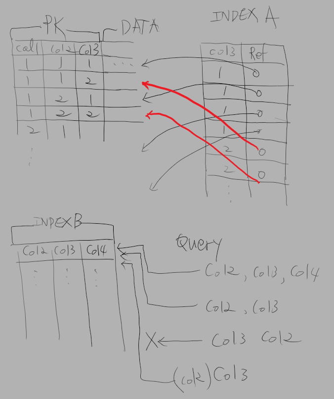

# Mysql

<!--
tag = programming, database, mysql
-->

- 데이터베이스에 대한 내용이나 인덱스에 대한 기능에 대해서 전문적인 지식이 아닌 개발을 하다가 습득한 조금의 방법을 정리하고자 한다.

## 클러스터 인덱스
- 인덱스는 정렬과 범위 기능을 처리하는 방법이다.
- 클러스터 인덱스, 논클러스터는 인덱스가 어떻게 생긴 것인지 직관을 가져다준 질문이다
- 데이터베이스의 처리를 이해하기 위해 가상의 간단한 데이터베이스를 생각해볼 수 있다. 데이터가 로우와 칼럼으로 저장된다. 데이터는 로우 기준 검색을 위해서 키값으로 정렬되어있다. 정렬된 데이터는 한 로우를 빠르게 찾아갈 수 있다. 데이터가 직접 정렬된 인덱스 구성을 클러스터 인덱스로 생각할 수 있다.
- 같은 데이터에 추가적인 정렬을 구성하고자 한다. 이때 처음 정렬상태를 바꾸지는 못하고 데이터 원본은 하나로 유지하기 위해서 새로운 정렬을 구성하는 키값과 해당 로우를 참조하는 정보를 새로운 정렬순서로 구성할 수 있다. 두 번째 정렬 값으로 로우를 찾아갈 때는 이 인덱스에서 참조 값을 찾고 참조 값을 통해 데이터를 찾아낸다.
- 이두 구성의 차이는 첫째는 직접 데이터에 접근하므로 조금 더 빠른 처리가 가능하며 단 하나만 구성할 수 있다. 두 번째는 참조를 통해 데이터에 접근하므로 한 번의 처리를 더 거치면 디스크 접근 상에서 연속되지 않은 접근을 해야 하기에 조금 느리며 여러 개의 인덱스를 구성할 수 있다. 인덱스를 여러 개 만들면 키값과 참조 값의 복제 저장이 이루어지므로 그만큼의 추가데이터 저장소를 요구하며 입력 시 인덱스 구성의 정보를 추가로 처리해야 하므로 셀렉트 성능은 올라가고 인서트, 업데이트 성능은 떨어진다. 또한, 인덱스 알고리즘 상 계속하여 한쪽 가중치에 인서트 되는 경우 효율이 떨어질 수 있어 최적화를 통해 개선할 수 있다.

## 인덱스 쿼리
- 인덱스는 1, 2, 3 구조를 순차적으로 찾아갈 때 적용될 수 있다. 1, 2, 3 순서의 키를 인덱스 구성하여 쿼리에서 1, 2, 3 순서로 정렬을 요청하면 해당 순서로 찾아간다. 또한, 1, 2 순서로 쿼리 정렬을 요청하면 같은 인덱스를 사용하여 순서를 찾아갈 수도 있다.
- Mysql에서는 1, 3 구조도 지원하지 않는다. 사람이 찾을 때는 1, 2, 3 구조의 인덱스가 있으면 1, 3 조건의 쿼리가 있는 경우 2를 가상의 값으로 생성하여 1, 가상의 2, 3 순서로 생각할 수 있으나 mysql 5.5 지금 버전 에서는 인덱스를 타지 못하는 것 같다. (테스트해보지 않은 경험적 결과) 물론 다른 데이터베이스의 경우 다르게 처리될 것이다. 이 경우 쿼리에서 2 전체에 해당하는 조건을 임의로 줘서 인덱스를 사용할 수는 있다.
- 쿼리에서 3, 1, 2 조건의 쿼리를 요청하는 경우 3조건을 앞에 가상의 1, 2를 생각하여 3 조건은 찾을 수 있다. 하지만 1, 2 조건은 앞에서 이미 사용했기 때문에 인덱스를 사용할 수 없다.
- Mysql 의 경우 order by에 DESC, ASC 를 복합하여 사용하는 경우 인덱스를 타지 않는다. 현재 버전에서 인덱스 생성 시 한쪽의 정렬 만을 지원하고 있어서 그렇게밖에 사용할 수 없으며 숫자 형의 경우 데이터를 마이너스 값으로 저장하여 인덱스를 구성할 수 있다.
- 일반적으로 평션을 사용하지 않는다. 평션과 칼럼의 값에 연산이 들어가는 경우 인덱스를 타지 못하기 때문에 아주 일반화된 평션이 아닌 경우 최대한으로 평션을 사용해서는 안 된다.
- 조인 쿼리시 내부조인의 경우 인덱스를 활용할 수 있어 정확한 데이터와 조건이 있는 경우 내부조인을 사용하여 인덱스를 활용할 수 있다.

## 쿼리작성
- where 조건 쿼리 작성 시 테이블 조건은 exists를 활용하여 성능을 개선하고 쿼리를 구조적으로 작성할 수 있다. 가상의 데이터베이스를 생각해 볼 때 조인을 사용하는 경우 때에 따라 모든 값을 조인 걸어 조건의 값을 찾는 경우가 발생할 수 있으나 exists 서브 쿼리에 조건을 구성할 수 있는 경우 조건에 해당하는 값이 처음 나올 때 exists 조건을 충족해 데이터 접근량을 줄일 수 있다.
- select 값의 테이블 값은 서브 쿼리로 풀어내면 쿼리를 작성하는데 쉽다. 조인을 많이 사용하는 경우 인덱스 확인이 편하고, from 절과 where 절이 분리되어있는 것보다 서브 쿼리로 하나로 있는 것이 쿼리 유지보수도 편하다.
- 서브 쿼리의 작성의 쉬움은 메모리 사용과 플랜을 다른 방식으로 풀 수 있어 실제 속도와 메모리 사용의 성능을 보장하지는 않는다.
- 쿼리 작성의 인덱스 사용은 쿼리의 플랜을 확인하여 정확히 확인할 수 있다. 가상의 데이터베이스를 생각할 때 플랜은 테이블의 로우 수나 정적 데이터와 동적 데이터를 구분하여 최적의 방법으로 생성할 수 있다. 때문에 플랜 쿼리의 조건 값을 정적 값과 동적 값을 구분하여 확인해야 하며 데이터의 빈도수나 로우수에 따라 개발 시 쿼리와 라이브 환경에서 쿼리가 서로 달라질 수 있음을 고려해야 한다.
- 쿼리를 작성할 때 가장 우선하는 인덱스는 최고 밖에 정렬 조건서부터 안으로 생각하거나 가장 안쪽의 서브 쿼리부터 밖의 쿼리로 순차적으로 생각할 수 있다. 하지만 이는 실제 쿼리의 메모리 사용 처리와 같은 관점이 아니기에 성능의 보장을 할 수는 없겠지만 쿼리를 작성하고 인덱스를 풀어감에 있어 유용하다.

## 정리
- 개인적으로 사용하는 방법들로 데이터베이스의 실제 처리를 이해하고 사용하는 방법이 아니어서 실제 성능을 보장해주지는 않지만, 가상의 데이터베이스를 내가 만드는 경우 이렇게 성능을 개선하겠다는 논리로서 쿼리를 작성하는데 충분한 성능 개선 요소를 제공한다. 또한, 이 논리는 Nosql 또는 프로세스 개발에서도 같이 효과를 볼 수 있다.
