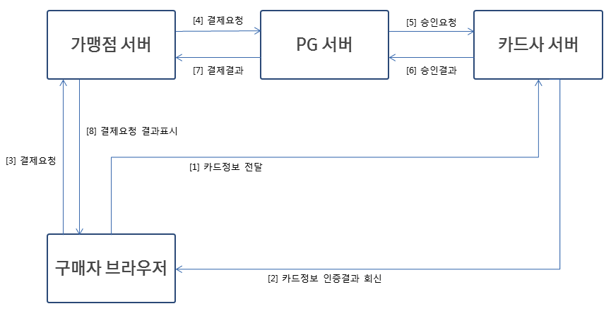

# iamport

<!--
description = 정리자료
tag = think
-->

## https://www.iamport.kr/
- https://www.iamport.kr/faq
- 복수 PG 기능
    - 기본 결제수단 외에 판매자가 필요로 하는 결제수단을 추가
    - PG사 결제서버의 장애에 대비
    - https://www.iamport.kr/pg
    - 1 pg 무료, 복수 pg 첫결제시 10만원
- pg - 카드사와 서비스 제공자간 거래 처리.
- 취소기한
    - 신용카드 : 결제 취소기간은 카드사별로 상이하나 통상 1년이내 취소가능하며, 취소시 별도 수수료 발생없이 원거래 취소됩니다. (예 : 롯데카드 180일내 가능)
    - 계좌이체 : 취소가능기간은 90일입니다. 
    거래취소를 요청하는 경우 당일분 거래에 대해서는 해당 고객계좌에 대한 출금지시를 취소하여 수수료를 포함한 전액을 고객계좌로 환불하고, 당일 이전거래에 대해서는 가맹점의 판매대금의 입금금액을 차감하여 고객계좌로 출금액 전액을 환불하며 가맹점으로 기 정산된 수수료는 반환하지 않습니다.
    - 가상계좌 : 취소 가능한 기간 제한없이 가맹점에서 PG사와 가상계좌 환불특약을 맺고 환불서비스 이용이 가능하며, 환불수수료가 발생됩니다. (페이코의 경우 가상계좌 환불서비스를 지원하지 않습니다.)
    - 휴대폰결제 : 당월 거래에 한해 취소가능하며, 취소시 별도 수수료 발생없이 원거래 취소됩니다. (예 : 9월 30일 거래 10월 1일 취소 불가)
- 매입 - 카드 결제의 경우 카드승인 후 처리시 상태값에 따라 결제 완료가 되지 않을 수 있음.
- 정산 - 금액을 확정하여 결산.
- 현재 아임포트를 통해 정기결제를 제공하는 PG사는 나이스정보통신과 JTNet, KG이니시스, 다날, NHN KCP, 한국정보통신(KICC),카카오페이 입니다
- 비인증결제
    - key-in 결제 - 카드번호,유효기간,카드 소지자 생년월일,카드 비밀번호 앞 2자리
    - 빌링 결제 - 정기적으로 결제 - 카드에 대한 정보를 미리 등록하여 결제시 사용하는 방식 결제. 나이스정보통신 api 빌링키 발급.
- 테스트 결제 진행 중 카드 사용이 정지 - 본인이 직접 카드사 처리.
- https://admin.iamport.kr/
    - 미결제상태 PG결제창을 열고 / 닫고 등
- 안심클릭 계열 (신한 / 현대 / 하나(외환) / 롯데 / 삼성 / NH )
- ISP 계열 ( KB국민 / 우리 / BC수협, 전북, 광주, 제주, 신협, 새마을금고 등 )
- 앱카드 (현대앱카드, 신한앱카드, 롯데앱카드 등)
- 거래고유번호(imp_uid), merchant_uid는 결제 요청시 가맹점에서 아임포트로 전달한 가맹점 고유 주문번호(Unique ID)
- 가상계좌, 현금영수증, 정기결제
- Notification 아임포트 webhook
- 부가가치세 - 요청시 amount(결제금액)속성과 tax_free(면세공급가액)
- 환불 - 가상계좌 환불을 위해서는, PG사의 가상계좌 특약서비스

## https://github.com/iamport/iamport-manual
### 인증결제
- 카드정보 입력 및 안심클릭인증 또는 ISP인증 후 결제가 진행되는 일반적인 결제 방식입니다.
- https://github.com/iamport/iamport-manual/blob/master/%EC%9D%B8%EC%A6%9D%EA%B2%B0%EC%A0%9C/background.md
- 카드정보(카드번호 / 유효기간 / CVC등)를 가맹점 또는 PG사에서 저장할 수 없도록

- 인증 - 카드사 서버가 구매자 브라우저로부터 직접 카드정보를 전달받아 인증처리해주는 부분
- 결제를 위한 통신은 가맹점 서버와 PG사 서버간. 실제 카드사로부터 결제승인에 대한 결과가 판단되며, 성공적으로 결제승인이 이뤄지거나 한도초과/분실카드 등의 사유로 결제승인에 실패.
- 안심클릭 계열 (신한 / 현대 / 하나(외환) / 롯데 / 삼성 / NH )
    - 카드번호, CVC, 안심클릭 비밀번호를 입력하여 카드정보를 인증하는 방식
    - 그림 키보드를 통해 카드번호, 안심클릭 비밀번호 등 보안정보를 입력하는 것이 특징
- ISP 계열 ( KB국민 / 우리 / BC수협, 전북, 광주, 제주, 신협, 새마을금고 등 )
    - ISP(Internet Secure Payment)는 공개키기반의 전자인증서를 통해 사전에 등록된 카드정보를 인증하는 방식
    - 모바일 결제에서는 스마트폰에 ISP앱 설치/인증서복사를 요구하며 설치된 ISP앱으로 이동하여 카드정보 인증 절차를 거치고 다시 원래 결제프로세스로 돌아온다는 큰 차이점
- 앱카드 (현대앱카드, 신한앱카드, 롯데앱카드 등)
    - 스마트폰 모바일 결제에 한하여, 안심클릭 계열의 카드사들이 ISP와 유사한 역할을 하는 인증용 앱을 별도로 운영하고 이 앱을 통해 카드정보를 인증하도록 제공

### 비인증결제
- 카드번호+유효기간+생년월일+비밀번호 확인을 통한 간략화된 인증 후 결제가 이루어지는 방식입니다.
최초 1회 카드정보 등록 후 매월 자동으로 결제가 이뤄져야 하는 정기구독형태의 과금 등 특수한 경우에 한하여 제공됩니다.
- https://github.com/iamport/iamport-manual/tree/master/%EB%B9%84%EC%9D%B8%EC%A6%9D%EA%B2%B0%EC%A0%9C
- key-in 결제
    - 주로 전화를 통한 비대면 상황에서 카드정보 + 개인정보를 활용해 결제승인이 일어나는 방식
    - 카드번호+유효기간+생년월일+비밀번호 확인을 통한 API채널로 전달함으로써 결제승인이 이뤄지는 방식이며 공인인증서, ISP인증서, 안심클릭비밀번호 등을 활용한 인증과정이 생략
- 빌링 결제
    - 1회성 결제가 아니라 정기적으로 결제가 반복되어야 하는 서비스에 활용
    - 결제승인이 이뤄진 후 빌링키가 발급이 되는데 2회차 결제승인부터는 빌링키를 사용하면 위 4가지 정보가 없어도 결제승인이 가능(그만큼 카드사, 이용자 입장에서 예민할 수 밖에 없는 결제방식이라 가맹점 계약 및 이용에 제약.)

## https://docs.iamport.kr/
- 계좌 이체(인증 결제)
    - dolgo 결제페이지(web-page)
    - pg 결제창 호출
        - { pg: "inicis", pay_method: "card", [*]merchant_uid: "ORD20180131-0000011", name: "노르웨이 회전 의자", [*]amount: 64900, buyer_email: "gildong@gmail.com", buyer_name: "홍길동", [*]buyer_tel: "010-4242-4242" }
    - dolgo 콜백 처리 imp_uid, merchant_uid
        - dolgo-api-server 처리 요청
        - 결과 화면 처리
    - dolgo-api-server 처리
        - imp 결제 정보 조회하기
        - 결제 위변조 여부 검증 후 데이터 동기화하기
    - dolgo-api-server Webhook
        - (cancel) imp 결제 정보 조회하기
        - 결제 위변조 여부 검증 후 데이터 동기화하기
- 카드 결제(빌링 결제)
    - dolgo 결제페이지(web-page)
    - 카드 등록 - 빌링키 발급받기
        - pg
        - card_number, // 카드 번호
        - expiry, // 카드 유효기간
        - birth, // 생년월일
        - pwd_2digit, // 카드 비밀번호 앞 두자리
    - 카드 결제 api 호출 > 결제완료
        - customerUid, merchantUid, amount, taxFree, name, buyerName, buyerEmail, buyerTel, noticeUrl
    - dolgo 콜백 처리 - 결과 화면 처리
- 정기 결제(빌링 결제)
    - dolgo 결제페이지(web-page)
    - 카드 등록 - 빌링키 발급받기
    - 정기 결제 api 호출 > 주문완료
    - 정기 작업
        - 카드 결제 api 호출 > 결제완료

## https://api.iamport.kr/
- POST /users/getToken
- billing-key
    - POST /subscribe/customers/{customer_uid} 구매자에 대해 빌링키 발급 및 저장
    - DELETE /subscribe/customers/{customer_uid} 빌링키 삭제
    - GET /subscribe/customers 빌링키 조회
- billing-key-pay
    - POST /subscribe/payments/again 빌링키로 재결제
- pay-validation
    - POST /payments/prepare 사전 정보 등록 payments.validation
    - GET /payments/{imp_uid} 아임포트 고유번호로 결제내역을 확인합니다
- webhook
    - imp_uid, merchant_uid, status
    - 결제가 승인되었을 때(모든 결제 수단) - (status : paid)
    - 가상계좌가 발급되었을 때 - (status : ready)
    - 가상계좌에 결제 금액이 입금되었을 때 - (status : paid)
    - 예약결제가 시도되었을 때 - (status : paid or failed)
    - 대시보드에서 환불되었을 때 - (status : cancelled)

## status (order, payment)
- code_value:1, name:주문완료
- code_value:2, name:결제완료
- code_value:3, name:정기결제완료
- code_value:-1, name:결제실패
- code_value:-2, name:결제완료취소
- code_value:-3, name:정기결제취소
- card payment.billing
    - order.status=order > exec-payment > order.status=pay paymnet.status=pay
    - fail paymnet.status=fail
    - cancel-webhook paymnet.status=cancel
- card-routine order.update
    - order.status=order > page-payment > order.status=order_routine
    - routine-pay paymnet.status=pay_routine
    - fail paymnet.status=fail
    - cancel order.status=order_routine_cancel
    - cancel-webhook paymnet.status=cancel
- account payment.validation
    - order.status=order > exec-payment > order.status=pay paymnet.status=pay
    - fail paymnet.status=fail
    - cancel-webhook paymnet.status=cancel

## db
```
CREATE TABLE `payment_order` (
  `type_code` int(10) NOT NULL DEFAULT '0' COMMENT '구분',
  `user_seq` int(10) NOT NULL DEFAULT '0' COMMENT '회원키',
  `content_type_code` int(10) NOT NULL DEFAULT '0' COMMENT '키구분',
  `content_seq` int(10) NOT NULL DEFAULT '0' COMMENT '키값',
  `payment_card_seq` int(10) NOT NULL DEFAULT '0' COMMENT '결제 카드 키',
  `price` int(10) NOT NULL DEFAULT '0' COMMENT '가격',
  `order_status` int(10) NOT NULL DEFAULT '0' COMMENT '주문 상태',
  `name` varchar(500) COLLATE utf8mb4_unicode_ci DEFAULT NULL COMMENT 'iamport 상품명',
  PRIMARY KEY (`seq`)
) ENGINE=InnoDB AUTO_INCREMENT=1001 DEFAULT CHARSET=utf8mb4 COLLATE=utf8mb4_unicode_ci COMMENT='주문-후원';

CREATE TABLE `payment` (
  `user_seq` int(10) NOT NULL DEFAULT '0' COMMENT '회원키',
  `type_code` int(10) NOT NULL DEFAULT '0' COMMENT '구분',
  `order_seq` int(10) NOT NULL DEFAULT '0' COMMENT '주문키',
  `payment_card_seq` int(10) NOT NULL DEFAULT '0' COMMENT '결제 카드 키',
  `price` int(10) NOT NULL DEFAULT '0' COMMENT '가격',
  `payment_status` int(10) NOT NULL DEFAULT '0' COMMENT '결제 상태',
  `payment_dt` datetime DEFAULT NULL COMMENT '결제일시',
  `payment_succ_dt` datetime DEFAULT NULL COMMENT '결제완료일시',
  `payment_cancel_dt` datetime DEFAULT NULL COMMENT '결제취소일시',
  `payment_fail_dt` datetime DEFAULT NULL COMMENT '결제실패일시',
  `payment_cancel_message` varchar(500) COLLATE utf8mb4_unicode_ci DEFAULT NULL COMMENT '결제취소메시지',
  `payment_fail_message` varchar(500) COLLATE utf8mb4_unicode_ci DEFAULT NULL COMMENT '결제실패메시지',
  `imp_uid` varchar(50) COLLATE utf8mb4_unicode_ci DEFAULT NULL COMMENT 'iamport uid',
  `pg` varchar(50) COLLATE utf8mb4_unicode_ci DEFAULT NULL COMMENT 'iamport pg(inicis)',
  `pay_method` varchar(50) COLLATE utf8mb4_unicode_ci DEFAULT NULL COMMENT 'iamport 결제 구분(card)',
  `merchant_uid` varchar(50) COLLATE utf8mb4_unicode_ci DEFAULT NULL COMMENT 'iamport 상품 uid',
  `name` varchar(500) COLLATE utf8mb4_unicode_ci DEFAULT NULL COMMENT 'iamport 상품명',
  `bank_name` varchar(50) COLLATE utf8mb4_unicode_ci DEFAULT NULL COMMENT 'iamport 은행 명칭 - (실시간계좌이체 결제 건의 경우)',
  `receipt_url` varchar(500) COLLATE utf8mb4_unicode_ci DEFAULT NULL COMMENT 'iamport 신용카드 매출전표 확인 URL',
  PRIMARY KEY (`seq`)
) ENGINE=InnoDB AUTO_INCREMENT=1001 DEFAULT CHARSET=utf8mb4 COLLATE=utf8mb4_unicode_ci COMMENT='결제';

CREATE TABLE `payment_card` (
  `use_yn` int(10) NOT NULL DEFAULT '0' COMMENT '사용yn 0:n, 1:y',
  `user_seq` int(10) NOT NULL DEFAULT '0' COMMENT '회원키',
  `card_type_code` int(10) NOT NULL DEFAULT '0' COMMENT '카드구분',
  `customer_uid` varchar(500) COLLATE utf8mb4_unicode_ci DEFAULT NULL COMMENT 'iamport customer_uid 빌링키',
  `card_disp` varchar(50) COLLATE utf8mb4_unicode_ci DEFAULT NULL COMMENT 'iamport 카드번호일부표시',
  `card_corp` varchar(50) COLLATE utf8mb4_unicode_ci DEFAULT NULL COMMENT 'iamport 카드사표시',
  PRIMARY KEY (`seq`)
) ENGINE=InnoDB AUTO_INCREMENT=1001 DEFAULT CHARSET=utf8mb4 COLLATE=utf8mb4_unicode_ci COMMENT='결제카드';
```
