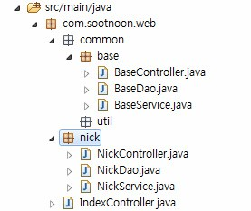

# Spring service-dao 설정

<!--
description = 조금 오래된 자료
tag = programming, java, spring
-->



## Spring service-dao 설정

- 프로젝트 설정에서
- <context:component-scan base-package="com.sootnoon.web" />으로 스캔하여 autowired 방식으로 bean 을 처리함
- @Component, @Repository, @Service, @Controller 스캔

## dataSource 설정

- dispatcher-servlet.xml

```
<!-- DataSource -->
<bean id="Datasource" class="org.springframework.jdbc.datasource.DriverManagerDataSource">
	<property name="driverClassName" value="com.mysql.jdbc.Driver" />
	<property name="url" value="jdbc:mysql://localhost:3306/bow" />
	<property name="username" value="username" />
	<property name="password" value="password" />
</bean>
<bean id="JdbcTemplate" class="org.springframework.jdbc.core.JdbcTemplate">
	<property name="dataSource" ref="Datasource" />
</bean>
```

## 소스

- NickController

```
@Controller
public class NickController extends BaseController {
	@Autowired
	private NickService nickService;
	@RequestMapping("/nick/list")
	public ModelAndView list(ReqNick req) {
		List<Nick>result = nickService.list(req);
		return new ModelAndView("nick/Nick", "result", result);
	}
}
```

- NickService

```
@Service
public class NickService extends BaseService {
	@Autowired
	private NickDao nickDao;
	public List<Nick>list(ReqNick req) {
		return nickDao.list(req);
	}
}
```

- NickDao

```
@Repository
public class NickDao extends BaseDao {
	@Autowired
	private JdbcTemplate jdbcTemplate;
	private String sqlList = "select 1;";
	public List<Nick>list(ReqNick req) {
		return jdbcTemplate.queryForList(sqlList, Nick.class);
	}
	private String sqlGet = "select 1;";
	public Nick get(ReqNick req) {
		return jdbcTemplate.queryForObject(sqlGet, Nick.class);
	}
	private String sqlInsert = "select 1;";
	public int insert(ReqNick req) {
		return jdbcTemplate.update(sqlInsert);
	}
}
```
