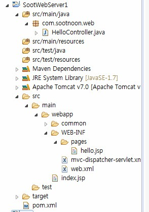

# Spring mvc 프로젝트 설정

<!--
description = 조금 오래된 자료
tag = programming, java, spring
-->



## description

- 개인적으로 생성한 maven, spring mvc 프로젝트
- 개발에는 tomcat, 배포에는 별도 컨테이너로 사용할 수 있는 방식을 maven을 통하지 않고 프로젝트에 설정함

## Maven 프로젝트 생성

- Create a simple project 체크, war 설정
- Pom.xml spring 추가

```
<properties>
	<spring.version>3.0.5.RELEASE</spring.version>
	<jdk.version>1.7</jdk.version>
</properties>

<dependencies>
	<dependency>
		<groupId>org.springframework</groupId>
		<artifactId>spring-core</artifactId>
		<version>${spring.version}</version>
	</dependency>
	<dependency>
		<groupId>org.springframework</groupId>
		<artifactId>spring-web</artifactId>
		<version>${spring.version}</version>
	</dependency>
	<dependency>
		<groupId>org.springframework</groupId>
		<artifactId>spring-webmvc</artifactId>
		<version>${spring.version}</version>
	</dependency>
	<dependency>
		<groupId>junit</groupId>
		<artifactId>junit</artifactId>
		<version>3.8.1</version>
		<scope>test</scope>
	</dependency>
</dependencies>

<build>
	<plugins>
		<plugin>
			<groupId>org.apache.maven.plugins</groupId>
			<artifactId>maven-compiler-plugin</artifactId>
			<version>3.0</version>
			<configuration>
				<source>${jdk.version}</source>
				<target>${jdk.version}</target>
			</configuration>
		</plugin>
	</plugins>
</build>
```

## Tomcat 개발 라이브러리 추가

- Web.xml 설정
- src\main\webapp\WEB-INF\web.xml
- dispatcher-servlet.xml 설정
- \src\main\webapp\WEB-INF\dispatcher-servlet.xml

## Controller 설정

- \src\main\java\com\sootnoon\web\HelloController.java

```
package com.sootnoon.web;
import org.springframework.stereotype.Controller;
import org.springframework.web.bind.annotation.RequestMapping;
import org.springframework.web.servlet.ModelAndView;
@Controller
public class HelloController {
	String message = "Welcome to your 1st Maven Spring project!";
	@RequestMapping("/hello")
	public ModelAndView showMessage() {
		System.out.println("from controller");
		return new ModelAndView("hello", "message", message);
	}
}
```

## Test file 설정

- \src\main\webapp\index.jsp
- \src\main\webapp\WEB-INF\pages\hello.jsp
- 테스트 서버생성
- http://localhost:8080/SootWebServer1/
- http://localhost:8080/SootWebServer1/hello.do

## 참조

- http://www.beingjavaguys.com/2013/08/spring-maven-web-application-in-eclipse.html
