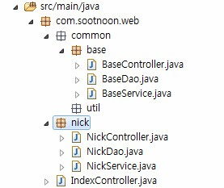

# Spring service-dao 설정

<!--
description = 정리자료
tag = programming, java, spring
-->



## Spring service-dao 설정

- 프로젝트 설정에서
- <context:component-scan base-package="com.sootnoon.web" />으로 스캔하여 autowired 방식으로 bean 을 처리함
- @Component, @Repository, @Service, @Controller 스캔

## dataSource 설정

- dispatcher-servlet.xml

```
<!-- DataSource -->
<bean id="Datasource" class="org.springframework.jdbc.datasource.DriverManagerDataSource">
	<property name="driverClassName" value="com.mysql.jdbc.Driver" />
	<property name="url" value="jdbc:mysql://localhost:3306/bow" />
	<property name="username" value="username" />
	<property name="password" value="password" />
</bean>
<bean id="JdbcTemplate" class="org.springframework.jdbc.core.JdbcTemplate">
	<property name="dataSource" ref="Datasource" />
</bean>
```

## 소스

- NickController

```
@Controller
public class NickController extends BaseController {
	@Autowired
	private NickService nickService;
	@RequestMapping("/nick/list")
	public ModelAndView list(ReqNick req) {
		List<Nick>result = nickService.list(req);
		return new ModelAndView("nick/Nick", "result", result);
	}
}
```

- NickService

```
@Service
public class NickService extends BaseService {
	@Autowired
	private NickDao nickDao;
	public List<Nick>list(ReqNick req) {
		return nickDao.list(req);
	}
}
```

- NickDao

```
@Repository
public class NickDao extends BaseDao {
	@Autowired
	private JdbcTemplate jdbcTemplate;
	private String sqlList = "select 1;";
	public List<Nick>list(ReqNick req) {
		return jdbcTemplate.queryForList(sqlList, Nick.class);
	}
	private String sqlGet = "select 1;";
	public Nick get(ReqNick req) {
		return jdbcTemplate.queryForObject(sqlGet, Nick.class);
	}
	private String sqlInsert = "select 1;";
	public int insert(ReqNick req) {
		return jdbcTemplate.update(sqlInsert);
	}
}
```

## Spring Mybatis 설정

- Pom.xml

```
<dependency>
	<groupId>commons-dbcp</groupId>
	<artifactId>commons-dbcp</artifactId>
	<version>1.4</version>
</dependency>
<dependency>
	<groupId>org.mybatis</groupId>
	<artifactId>mybatis</artifactId>
	<version>3.2.3</version>
</dependency>
<dependency>
	<groupId>org.mybatis</groupId>
	<artifactId>mybatis-spring</artifactId>
	<version>1.2.1</version>
</dependency>
```

- Web.xml
- /WEB-INF/spring/root-context.xml
- /WEB-INF/mybatis/mybatis-context.xml
- Mapper.xml

```
<?xml version="1.0" encoding="UTF-8"?>
<!DOCTYPE mapper PUBLIC "-//mybatis.org//DTD Mapper 3.0//EN" "http://mybatis.org/dtd/mybatis-3-mapper.dtd">
<mapper namespace="com.dao.MemberDao">
	<insert id="add" parameterType="map">
		insert into member (email,pass,nickname)
		values (#{email},#{pass},#{nickname})
	</insert>
	<select id="checkMember" parameterType="map" resultType="map">
		select * from member where email = #{email}
	</select>
</mapper>
```

- Dao

```
@Autowired
private SqlSession sqlSession;
public void method() {
	sqlSession.queryForObject("mapper namespace.queryId");
}
```

- Mysql Auto-increment key

```
<insert id="someId">
Query...
<selectKey keyProperty="no" resultType="int" order="AFTER">
Select Last_insert_id();
</selectKey>
</insert>
```

- 파라미터로 넘어간 map 에 key 값이 포함되어 결과
- Mapper #{value} statement 처리, ${value} replace 처리
- Lt gt 문자<![cdata[]]>사용 가능
- Param, result map 값 java.util.HashMap 동의어
- Param result VO 클래스 맵핑가능
