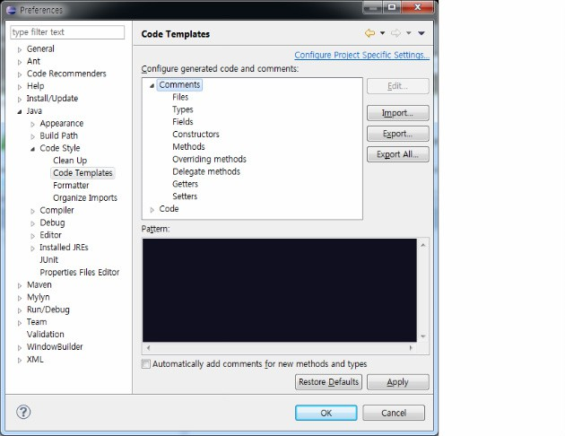

# Eclipse Javadoc

<!--
description = 조금 오래된 자료
tag = programming, tool, eclipse
-->

## javadoc 설정



### 최소한으로 사용하는 자바독 템플릿

- 기본적으로 주석은 최소로 하는것을 원칙으로 하며 나머지 템플릿은 기본적으로 설정된 값을 활용한다. 개인적 사용
- 이클립스 설정의 Java>Code Style>Code Templates 에서 설정해 준다.

```
// file
/**
*<PRE>
* Functionality :
* Description :
*
* Copyright (c) shimjye@gmail.com All rights reserved.
*</PRE>
*
* @version 1.0
* @author shimjye@gmail.com
*/
// methods
/**
*<PRE>
* Functionality :
* Description :
* History : ${date}, shimjye@gmail.com, Ver1.0 최초작성
*</PRE>
*
* ${tags}
*/
// overriding methods
/**
* {@inheritDoc}
*
* ${see_to_overridden}
*/
```

## javadoc 문서 만들기

- 오래전에 적어둔거라 버전업 상태나 다시 실행은 안해봄.
- dbdoclet xml만들기
- dbkpack pdf, html 문서만들기

### jeldoclet javadoc xml 만들기

- xml 생성기능보다 문제가 없었던것으로 기억
    * http://sourceforge.net/projects/jeldoclet
- javadoc 오류 = classpath 의 [%] 오류 =>[%] 설정 지우기
    * http://gayafoundation.blogspot.com/2008/06/50-javadoc.html
