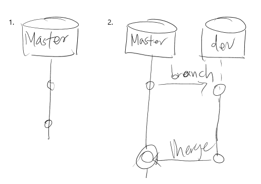
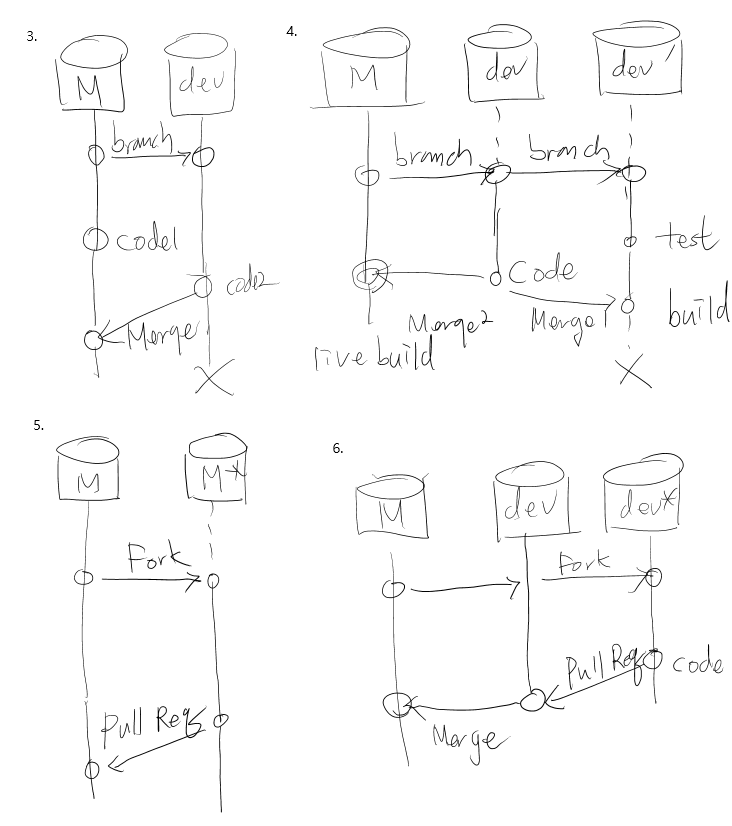

# Github

<!--
description = 정리자료
tag = programming, tool, scm, git
-->

#깃허브

개인적으로 소스관리 시스템을 사용하기 시작한 이후 항상 소스관리시스템을 사용해 왔지만 , 전략적 분석없이 단순한 마스터 커밋&업데이트의 가장단순한 방법만을 사용해 왔다. 하지만 회사에서 깃을 사용하게 되었고 업무적으로 브랜치 머지를 사용하기 시작하고 깃에 편리성을 느끼며 전략에대한 정리를 하고자 한다.
Svn을 상당한 기간동안 사용했었지만 단순한 마스터만 사용했기에 깃과의 차이점을 분석하거나 깃에 대한 전략을 완벽하게 설명 할 수는 없지만, 개발자로서 사용하며 느낀점을 정리하고자 한다.

## 브랜치 전략 타입

1. 마스터 단독 전략 - 가장 간단.
2. 기능 브랜치, 머지 전략 - 기능을 독립해서 개발.
3. 독립 브랜치, 머지, 삭제 전략 - 기능을  독립해서 동시에 개발.
4. 브랜치, 테스트 빌드 전략 - 테스트 기능을 별도 브랜치로 임시사용 개발.
5. Fork, Pull Request 전략 - 깃허브의 기능을 이용, 각각 개발 후 Pull Request 리뷰 가능.
6. Pull Request, 머지, 브랜치 통합 전략 - 깃허브를 통해 Pull Request를 생성하는 경우 다른 버전이 생성되어 두 브랜치간 버전은 하나로 되지않는다. 머지를 통해 브랜치 버전을 하나로 처리.

## 깃 특징

위의 브랜치 전략은 실질적 사용하고자 하는 전략이 아닌 위상적으로 분해된 구성할 수 있는 전략이며 실제 사용에 있어서는 위 전략의 조합으로 사용하게 된다.
깃 특징의 정확한 분석은 아니겠지만 공부하며 개인적 사용간 느끼는 주요 특징이다. 설명하는 전략은 이런 특징점에 의해 구성되어 사용된다. 특히 깃허브만의 기능으로 Fork 와 Pull request 의 기능적 특징으로 전략이 구성된다.
- 깃은 파일의 내용을 기반으로 버전을 생성한다.
- 브렌치간 레벨구분이 없이 동등한 레벨이다.
- 처리 속도가 빠르다.
- 로컬에 별도저장소를 만든다
- 분산저장소 기능
- Fork 로 브랜치(깃허브)
- Pull Request로 리뷰기능(깃허브)

## 브랜치 전략 분석

1. 마스터 단독 전략
첫번째 전략은 단순하게 마스터만 사용하는 방법이다. 주로 간단하거나 혼자 사용할 때 사용한다. 원격저장소 없이 로컬에 단순마스터 저장소만 사용하는 경우도 유용하다.
깃을 사용하며 느끼는 가장큰 장점은 빠른점이다. Svn에서 일부 오류가 나오는 점 말고 불편을 느낀지 못했었는데 이사를 하게된 가장 우선적 이유는 이점이다. 브랜치간 레벨이없고 로컬에 저장소를 구성한다는 점이 빠름의 이유중의 하나이다.
2. 기능 브랜치, 머지 전략
기능을 분리해서 개발하기 시작하면 브랜치를 만들어 작업을 할 수 있다. 작업 완료 후 머지 작업을 통해서 마스마 브랜치에 소스를 적용한다. 이 단계에서는 특별한 전략을 가진다기 보다는 머지에서 Dev 브랜치와 마스터 브랜치의 소스가 정확하게 같게 된다. Git에서는 소스의 구성이 같은 경우 같은 버전으로 생성되고 마스터와 Dev 는 같은 버전으로 히스토리의 트리의 경우 브랜치로 나뉜 가지가 합쳐진다.
3. 독립 브랜치, 머지, 삭제 전략
2가지 이상의 기능이 분리되어 작업이 되는 경우 생성되는 브랜치 전략이다. 대부분 복합적인 작업의 경우 발생하며, 그림에서는 가장 간단하게 마스터와 Dev 브랜치로 표현되었다. Dev 에서 독립적으로 작업이 진행되고 동시에 마스터에 작업이 이루어 진다. 이경우 머지를 통해 Dev를 마스터로 보내는 경우 Dev 소스와 마스터 소스가 마스터 소스에 작업한 소스내용으로 같지 않다. 그 결과 버전이 다르게 생성되고 두 브랜치는 히스토리 트리는 별도인 상태로 유지된다. 같은 상태로 만들기 위해서는 반대 방향으로 마스터에서 Dev로 머지하여 마스터의 수정 소스를 Dev로 보내서 소스를 정확하게 같게 하여 하나의 버전으로 통합할 수 있고, 또는 전략적으로 나뉜 브랜치를 이용하여 계속적으로 작업을 하는 방법, 브랜치를 삭제하고 신규 브랜치를 생성하는 전략을 택할 수 있다.
개인적으로 계속적으로 작업을 하는 경우 Dev 브랜치의 작업이 최종작업물과 달라 머지시 충돌의 발생이나 정확하지 않은 테스트로 비효율적이라 생각하며, 그림에서는 삭제 후 신규 브랜치 전략을 표현했다. 머지하여 하나의 버전으로 만드는 방법은 2번의 전략과 동일한 형식으로 생각할 수 있다.
4. 브랜치, 테스트 빌드 전략
특수한 경우 사용할 수 있는 방식으로 실용성은 별로 없다고 생각한다. 기본적으로 테스트 코드의 브랜치를 별도로 두고 실제 빌드에는 나가지 않도록 할 수 있다. 단순한 테스트 코드의 경우 브랜치를 만드는 것 보다는 히스토리에서 제거하는 방식이 단순하고 노력도 적게 드는 것 같다.
5. Fork, Pull Request 전략(깃허브)
깃허브의 Fork 기능을 이용하여 브랜치 생성을 대체할 수 있다. 기본적인 전략은 3번의 브랜 치 전략과 동일하다. 대신 Pull Request 기능을 통해서 리뷰를 활용할 수 있다. 그리고 차이점은 Pull Request 가 추가된 점에서 마스터와 Dev 브랜치의 버전이 같아지지 않는다. 소스는 정확하게 일치하지만 Git 에 Pull Request 내용을 포함해 버전이 측정되는 것으로 짐작되며, 버전이 다르고 히스토리 트리가 하나로 되지 않는다.
6. Pull Request, 머지, 브랜치 통합 전략(깃허브)
마지막으로 5번 전략과 2번 전략을 통합해 작업은 Dev 브랜치의 Fork Dev* 에서 수행 Dev 브랜치로 Pull Request 를 수행하여 리뷰를 수행하고, Dev 브랜치에서 마스터 브랜치는 상위 권한자에 의해서 2번전략의 머지를 통해 Dev 마스트 브랜치의 버전을 동일하게 만들어 트리를 그려가는 전략이다. 이전략은 2번에서 나타나는 버전의 통합으로 히스토리 트리에서 소스가 정확히 같다는 확인을 할 수 있으며, 브랜치를 만들어 여러 작업을 동시에 진행 할 수 있으며, Pull Request 를 통해 리뷰를 진행 할 수 있다.

## 브랜치 전략

브랜치 모델 http://nvie.com/posts/a-successful-git-branching-model
많이 참고하는 위 링크의 브랜치 전략은 내가 구성한 전략과 같은점을 가지며 유용하다. 하지만 글 과 그림에 설명이 부족하다는 생각을 한다. 주로 버전 트리 그림이 정확하지 않다는 점이다. 복잡한 작업에서는 혼합형 전략인 6번전략을 참고 전략처럼 사용한다면, 전략에 따르는 여러 장점을 통해 개발을 할 수 있을것이라 생각한다.
어떤 전략이 월등하게 좋지는 않다. 전략을 이해하고 어떤점이 다르고 어떤점에 주의 해야 하는지 알고 작업한다면 보다 좋은 방법으로 개발을 진행할 수 있을 것 같다.

